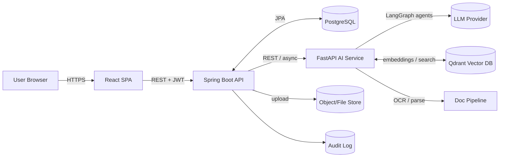

# LexMind AI — Product Requirements Document (PRD)

**Document:** Phase 1 / 05 (master)
**Status:** Draft for review
**Version:** 0.1
**Owner:** Product
**Last updated:** 2026-06-13

> This PRD is the source of truth for *what* we are building and *why*. It binds together the
> [Problem Statement](01-problem-statement.md), [Market Analysis](02-market-analysis.md),
> [Personas](03-user-personas.md), and [Feature Breakdown](04-feature-breakdown.md), and
> defines scope, requirements, metrics, and constraints that downstream phases implement.

---

## 1. Vision & Mission

**Vision.** Become the **Legal Operating System for case analysis** — the default place
where legal documents become structured legal intelligence.

**Mission.** Help law students, advocates, researchers, and firms **analyze cases from every
angle** using AI — to organize legal thinking, accelerate research, assist litigation
strategy, and improve legal education — **without giving legal advice or replacing lawyers**.

**One-line.** *Upload a case. Get a complete legal intelligence dashboard.*

---

## 2. Goals & Non-Goals

### Goals
1. Turn a messy document set into a **structured, navigable, exportable** case dashboard.
2. Make every AI output **grounded and citeable** (no hallucinated authorities).
3. Serve **both education (IRAC, briefs) and practice (strategy, readiness, risk)** from one
   engine.
4. Ship a **secure, role-based, auditable** platform suitable for sensitive legal data.
5. Architect for **scale and future mobile** without backend redesign.

### Non-Goals (v1)
- ❌ Legal advice / outcome guarantees.
- ❌ Contract drafting / CLM (transactional).
- ❌ Billing/accounting practice management.
- ❌ Court e-filing integration.
- ❌ Multi-language legal corpora (English-first).

---

## 3. Target Users & Roles

Five roles map to the five personas (full detail in [Personas](03-user-personas.md)):

| Role | Persona | Portal |
|---|---|---|
| `SUPER_ADMIN` | Vikram | Admin |
| `LAW_FIRM_ADMIN` | Sana | Advocate (firm) + Admin (tenant) |
| `ADVOCATE` | Meera | Advocate |
| `RESEARCHER` | Rohan | Research |
| `LAW_STUDENT` | Aarav | Student |

### 3.1 RBAC — Permission Matrix

Permissions are `resource:action`. ✓ = allowed, **own** = own resources only,
**firm** = within firm tenant, — = denied.

| Permission | SUPER_ADMIN | LAW_FIRM_ADMIN | ADVOCATE | RESEARCHER | LAW_STUDENT |
|---|:--:|:--:|:--:|:--:|:--:|
| `case:create` | ✓ | ✓ | ✓ | ✓ | ✓ |
| `case:read` | ✓ | firm | own | own | own |
| `case:update` | ✓ | firm | own | own | own |
| `case:delete` | ✓ | firm | own | own | own |
| `document:upload` | ✓ | firm | own | own | own |
| `analysis:run` | ✓ | firm | own | own | own |
| `evidence:analyze` | ✓ | firm | own | — | — |
| `witness:analyze` | ✓ | firm | own | — | — |
| `strategy:view` | ✓ | firm | own | — | — |
| `irac:view` | ✓ | firm | own | own | own |
| `research:citation` | ✓ | firm | own | ✓ | own |
| `analytics:firm` | ✓ | firm | — | — | — |
| `user:manage` | ✓ (all) | firm | — | — | — |
| `audit:read` | ✓ (all) | firm | — | — | — |
| `ai:monitor` | ✓ | — | — | — | — |
| `system:configure` | ✓ | — | — | — | — |

> Enforced at the API layer (Spring Security method-level + tenant filter). Detailed in
> Phase 2 (security) and Phase 4 (backend).

---

## 4. Scope — Functional Requirements (FR)

Functional requirements are traced to feature IDs in the
[Feature Breakdown](04-feature-breakdown.md). Summary of in-scope capabilities:

- **FR-A Authentication & RBAC** — register/login/JWT, password reset, role-based access. *(F0)*
- **FR-B Document Ingestion** — secure upload, OCR, parse, classify, metadata, async pipeline. *(F1)*
- **FR-C Case Workspace** — create/manage/repository of matters. *(F2)*
- **FR-D Case Analysis Dashboard** — overview, timeline, fact matrix, issues, statutes,
  arguments, evidence, witnesses, precedents. *(F3)*
- **FR-E IRAC Dashboard** — auto IRAC per case/issue. *(F4)*
- **FR-F Analytics Center** — strength, risk, readiness, research intelligence, trends. *(F5)*
- **FR-G AI Agents** — 7 agents orchestrated via LangGraph. *(F6)*
- **FR-H Advanced Assistants** — case brief, RAG chat, hearing prep, cross-exam, strategy. *(F7)*
- **FR-I Research Portal** — citation, similar-case, trends, workspace. *(F8)*
- **FR-J Admin & Observability** — user mgmt, audit, AI/doc monitoring, analytics. *(F9)*
- **FR-K Cross-cutting** — search, filters, export, theming, charts, PDF viewer, public site. *(F10)*

The **MVP** subset is defined in [Feature Breakdown §12](04-feature-breakdown.md). The core
user journey the MVP must deliver:

```
Register/Login → Create Case → Upload Document(s)
    → [async] OCR + Parse + Classify + Extract
    → AI agents produce: Facts, Timeline, Issues, Statutes, Arguments, IRAC
    → User views Case Analysis Dashboard + IRAC + Case Brief
    → User chats with the case (RAG) → Exports PDF
```

---

## 5. Non-Functional Requirements (NFR)

| # | Category | Requirement |
|---|---|---|
| NFR-1 | **Performance** | Dashboard interactions < 300 ms p95 (excluding AI). AI analysis is async with progress; first agent result surfaced as available. |
| NFR-2 | **Scalability** | Stateless backend (horizontal scale); async AI/doc workers; vector DB scales independently. Future mobile via the same REST API. |
| NFR-3 | **Availability** | Target 99.5% for app tier; graceful degradation if AI service is down (dashboards remain viewable). |
| NFR-4 | **Security** | JWT auth, RBAC, input validation, rate limiting, secure uploads, OWASP Top 10 controls, encryption in transit (TLS) and at rest for documents. |
| NFR-5 | **Privacy/Compliance** | Tenant/data isolation, audit logging, data-deletion support, alignment with India DPDP principles; "no legal advice" disclaimers. |
| NFR-6 | **Reliability of AI** | Every AI claim grounded in source passages; citations verifiable; low-confidence outputs flagged; no fabricated authorities. |
| NFR-7 | **Observability** | Structured logging, request tracing, AI cost/latency/error metrics, document-pipeline health. |
| NFR-8 | **Maintainability** | Clean modular monorepo, typed APIs (OpenAPI), 80%+ test coverage target, CI. |
| NFR-9 | **Usability/Accessibility** | Responsive (desktop→mobile browser), dark/light, keyboard-navigable, WCAG-AA-leaning. |
| NFR-10 | **Cost** | Control LLM/OCR spend via chunking, caching, tiered limits, and model selection. |
| NFR-11 | **Portability** | Dockerized; deployable locally and on Railway/Render/AWS. |

---

## 6. System Overview (Preview of Phase 2)



Full HLD/LLD, ER diagram, and AI architecture are delivered in **Phase 2**. Default
technical decisions (see §10) are recorded now to keep phases consistent.

---

## 7. Success Metrics (KPIs)

### Product / value
| Metric | Target (v1) |
|---|---|
| Time-to-first-dashboard after upload | < 3 min for a typical judgment |
| Student "time-to-understand a case" | ↓ 70% vs. manual (self-reported) |
| Advocate hearing-prep time per matter | ↓ 60% |
| AI citation groundedness (sampled audit) | ≥ 95% claims traceable to source |
| Dashboard export usage | ≥ 50% of analyzed cases exported |

### Growth / business
| Metric | Target (yr 1 directional) |
|---|---|
| Registered students | 25k |
| Free→paid conversion (students) | 3–5% |
| Paying advocates | 1–2k |
| Firm pilots | 10–20 |
| Net revenue retention (firms) | > 100% |

### Engineering / quality
| Metric | Target |
|---|---|
| Test coverage | ≥ 80% |
| p95 non-AI API latency | < 300 ms |
| Critical security findings (OWASP) open | 0 at release |
| AI agent error rate | < 2% of runs |

---

## 8. Assumptions

- Users can supply their own documents; we are not required to host paywalled corpora for MVP.
- A capable LLM provider is available (default: latest Claude models, e.g. `claude-opus-4-8`
  for heavy reasoning, a smaller/faster Claude for cheap steps); provider is abstracted so it
  can be swapped/self-hosted later.
- English-language Indian legal documents for v1.
- Public judgments suffice to seed an initial precedent corpus.

---

## 9. Constraints

- **Legal/ethical:** no legal advice; human-in-the-loop; persistent disclaimers.
- **Regulatory:** India DPDP-aligned data handling; confidentiality of privileged documents.
- **Resource (capstone):** built by a small team; favor managed services and proven OSS.
- **Cost:** AI pipeline must stay within tiered-pricing unit economics.

---

## 10. Key Product/Tech Decisions (locked for consistency)

| Decision | Choice | Rationale |
|---|---|---|
| Vector DB | **Qdrant** | Production-grade, scalable, Docker-friendly, good filtering; vs. Chroma (simpler but lighter for prod). |
| LLM access | **Provider-abstracted**, default latest Claude | Quality on long-doc reasoning; abstraction avoids lock-in. |
| AI orchestration | **LangGraph** | Stateful multi-agent graphs fit the 7-agent pipeline. |
| OCR | **Tesseract** (pluggable) | OSS, good enough for v1; can upgrade to cloud OCR later. |
| Async processing | Queue + workers | Doc/AI work is long-running; keep API responsive. |
| AuthN/Z | **JWT + Spring Security** | Stateless, scalable, standard. |
| Multitenancy | Firm tenant + row-level scoping | Supports firms without separate DBs in v1. |
| API contract | **OpenAPI/Swagger** | Typed contract → FE/BE/AI consistency. |

These are defaults; Phase 2 may refine with documented Architecture Decision Records (ADRs).

---

## 11. Risks & Mitigations

| Risk | Likelihood | Impact | Mitigation |
|---|---|---|---|
| AI hallucinates citations/law | Med | High | RAG grounding + citation verification + low-confidence flags + human-in-loop + disclaimers |
| LLM/OCR cost blows up | Med | Med | Chunking, caching, tiered limits, cheaper models for cheap steps |
| Privacy/security breach of sensitive docs | Low | High | Encryption, RBAC, audit, pen-test, least privilege, secure uploads |
| Scope creep (10 phases) | High | Med | Strict MVP definition, MoSCoW, phase gates with review |
| Precedent corpus access | Med | Med | Start BYO-document + public judgments; partnerships later |
| Professional/legal liability | Med | High | "No legal advice" framing, ToS, human-in-loop, no outcome guarantees |
| Model/provider change | Med | Low | Provider abstraction layer |

---

## 12. Release Plan & Phase Mapping

| Build phase | Produces | Feeds release |
|---|---|---|
| P1 Product | This PRD + foundation | — |
| P2 Architecture/DB/AI | HLD/LLD, ER, AI arch, ADRs | all |
| P3 UI/UX | wireframes, nav, component hierarchy | MVP |
| P4 Backend | Spring Boot APIs, RBAC, persistence | MVP |
| P5 Frontend | React app, dashboards | MVP |
| P6 AI agents | LangGraph agents + RAG | MVP→v1 |
| P7 Analytics | analytics center dashboards | v1 |
| P8 Testing | unit/integration/API/security, 80%+ | all |
| P9 Deployment | Docker, CI/CD, Railway/Render/AWS | all |
| P10 Docs | Synopsis, SRS, SDD, report, viva | all |

Release content per the [Feature Breakdown §13](04-feature-breakdown.md): **MVP** (core
loop) → **v1** (practice + analytics) → **v2** (depth + collaboration).

---

## 13. Open Questions (to resolve before/within Phase 2)

1. **LLM provider & budget** — confirm default provider, model tiers, and monthly cost ceiling.
2. **Precedent corpus** — which public judgment sources to seed (e.g., open court datasets)?
3. **Object storage** — local filesystem (dev) vs. S3/MinIO (prod) for documents.
4. **Tenancy depth** — row-level scoping (v1) vs. schema-per-tenant (later)?
5. **Export fidelity** — server-side PDF rendering vs. client-side?

> These do not block Phase 2; they will be answered as ADRs.

---

## 14. Glossary

| Term | Meaning |
|---|---|
| **IRAC** | Issue, Rule, Application, Conclusion — a legal-reasoning framework |
| **RAG** | Retrieval-Augmented Generation — grounding LLM answers in retrieved documents |
| **Ratio / Holding** | The binding legal reasoning / decision of a judgment |
| **Matter / Case** | A unit of legal work; a collection of documents + analysis |
| **Precedent** | A prior judgment relevant to the current case |
| **RBAC** | Role-Based Access Control |
| **Tenant** | An isolated firm/organization workspace |

---

_Previous: [← Feature Breakdown](04-feature-breakdown.md) · Phase 1 complete._
