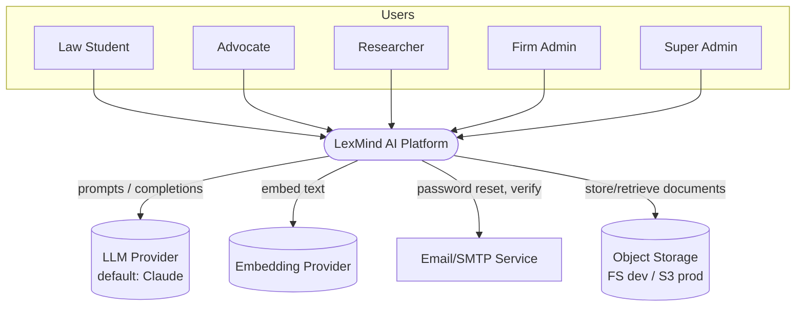
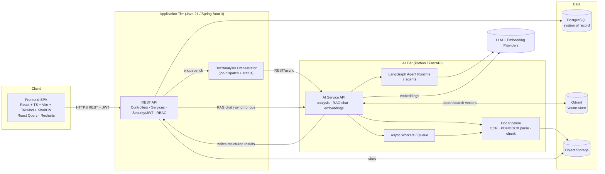
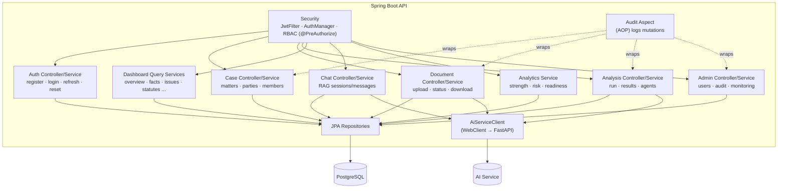
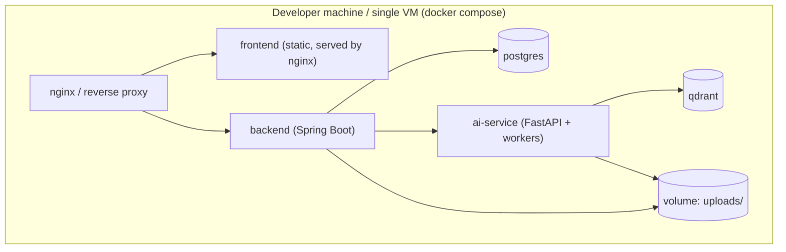
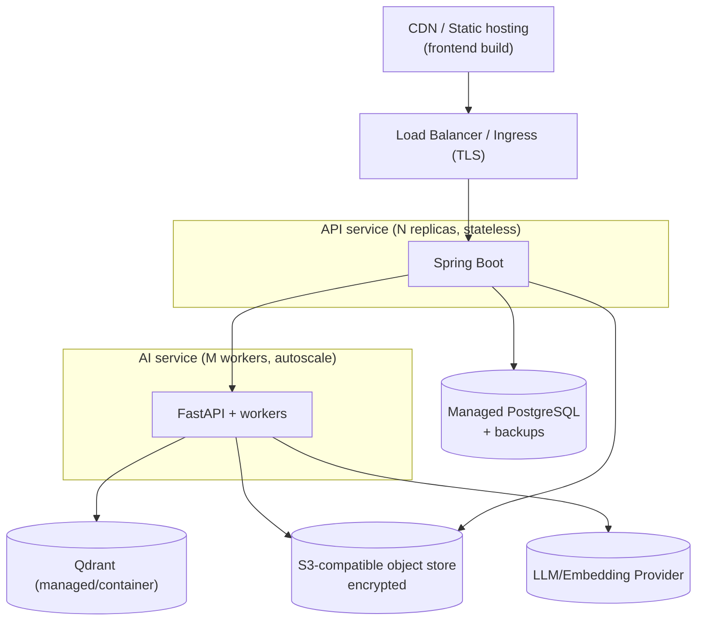

# LexMind AI — System Architecture Overview (HLD)

**Document:** Phase 2 / 01
**Status:** Draft for review
**Owner:** Solution Architecture
**Last updated:** 2026-06-14

> High-Level Design. Defines the system's shape, components, boundaries, data flows, and
> deployment topology. Low-level detail (classes, sequences) is in
> [02-low-level-design.md](02-low-level-design.md); data in
> [03-database-design.md](03-database-design.md); AI internals in
> [05-ai-architecture.md](05-ai-architecture.md); decisions in [06-adrs.md](06-adrs.md).

---

## 1. Architectural Principles

1. **Separation of concerns by runtime** — three independently deployable services
   (Web/SPA, Application/API, AI) so the heavy AI workload never blocks the transactional API.
2. **Stateless application tier** — JWT auth, no server session state → horizontal scale and
   future mobile reuse of the same REST contract.
3. **Async for anything slow** — OCR, parsing, embedding, multi-agent analysis run on
   workers behind a queue; the API returns immediately with a job/status.
4. **Grounded AI** — every AI claim must reference a source chunk; the vector store is the
   retrieval backbone (RAG), not the system of record.
5. **System of record = PostgreSQL** — structured analysis is normalized and queryable;
   Qdrant holds only embeddings + chunk pointers.
6. **Secure & auditable by default** — RBAC at the API, tenant scoping, audit log on every
   mutating action, secure file handling.
7. **Provider-abstracted AI** — the LLM and embedding providers sit behind an interface, so
   models can be swapped (managed Claude ↔ self-hosted) without touching business logic.

---

## 2. C4 Level 1 — System Context



**Boundary:** LexMind AI owns the SPA, API, AI service, PostgreSQL, and Qdrant. It depends on
external LLM/embedding providers, an SMTP service, and object storage.

---

## 3. C4 Level 2 — Container Diagram



### Container responsibilities

| Container | Tech | Responsibility |
|---|---|---|
| **Frontend SPA** | React/TS/Vite/Tailwind/ShadCN | All UI, role-aware routing, dashboards, charts, PDF view, exports. Talks only to the API. |
| **REST API** | Spring Boot 3 | AuthN/Z, RBAC, CRUD, persistence (JPA), orchestration of AI jobs, audit logging, file intake. The **only** writer to PostgreSQL. |
| **Doc/Analysis Orchestrator** | Spring (async) | Creates analysis runs, dispatches to AI tier, tracks status, persists returned structured results. |
| **AI Service API** | FastAPI | Stateless endpoints for document processing, agent analysis, and RAG chat. Owns Qdrant access + provider calls. |
| **LangGraph Agent Runtime** | Python/LangGraph | The 7-agent graph that produces structured legal intelligence. |
| **Doc Pipeline** | Python (Tesseract, pdf libs) | OCR, text/structure extraction, metadata, chunking, embedding. |
| **PostgreSQL** | 16 | System of record: users, cases, documents, all structured analysis, audit. |
| **Qdrant** | latest | Embeddings + chunk metadata for RAG retrieval and similar-case discovery. |
| **Object Storage** | FS (dev) / S3-compatible (prod) | Original uploaded documents (encrypted at rest in prod). |

> **Why a separate AI tier (vs. doing AI in Spring)?** Python is where the AI ecosystem
> lives (LangGraph, OCR, embedding clients). Isolating it lets us scale AI workers
> independently, keep the API responsive, and fail gracefully (dashboards stay viewable if
> the AI tier is degraded). See [ADR-0002](06-adrs.md).

---

## 4. C4 Level 3 — Component Diagram (Application Tier)



Layering per module: **Controller → Service → Repository**, with DTOs at the boundary and
entities never leaking past services. Cross-cutting concerns (security, audit, validation,
error handling) are filters/aspects/advice.

---

## 5. Request Flows (overview; sequences in LLD)

**A. Synchronous (transactional):** SPA → API → PostgreSQL → SPA. Sub-300 ms target.
Examples: login, list cases, read a dashboard section.

**B. Asynchronous (heavy AI):**
```
SPA → API: POST /cases/{id}/analyze
API: create analysis_run(status=QUEUED) → enqueue → return 202 {runId}
Worker → AI Service: process documents (OCR/parse/chunk/embed) then run agent graph
AI Service → API callback: persist structured results, run status=COMPLETED
SPA: polls GET /analysis/{runId} (or SSE) → renders dashboard as sections complete
```

**C. RAG chat (interactive):**
```
SPA → API: POST /cases/{id}/chat {question}
API → AI Service: /chat (case scope) → retrieve top-k chunks from Qdrant → LLM with context
AI Service → API: answer + citations[] → persist chat_message → SPA renders grounded answer
```

---

## 6. Deployment Topology

### 6.1 Local / dev (Docker Compose)



### 6.2 Cloud (prod target — Railway/Render/AWS)



**Scaling levers:** API replicas behind LB (stateless); AI workers autoscale on queue depth;
PostgreSQL read replicas if needed; Qdrant scales independently; object storage is elastic.
Full deployment detail (Dockerfiles, compose, CI/CD) is delivered in **Phase 9**.

---

## 7. Cross-Cutting Concerns

| Concern | Approach |
|---|---|
| **Security** | JWT + Spring Security, method-level RBAC, tenant row-scoping, rate limiting, secure uploads, OWASP controls (detailed in Phase 2 security notes + Phase 4). |
| **Observability** | Structured JSON logs, correlation/trace IDs propagated SPA→API→AI, AI cost/latency/error metrics, doc-pipeline health, health/readiness probes. |
| **Resilience** | Async + retries with backoff for AI calls; circuit-breaker around AI tier; idempotent job processing; graceful degradation (dashboards viewable without AI). |
| **Config/secrets** | 12-factor env vars; secrets via env/secret manager; `.env.example` committed, real `.env` ignored. |
| **Error handling** | Consistent API error envelope (`code`, `message`, `traceId`, `details`); global exception handler. |
| **Versioning** | API under `/api/v1`; OpenAPI contract is the source of truth. |

---

## 8. Technology Rationale (summary)

| Choice | Why (short) | ADR |
|---|---|---|
| 3-tier split (SPA / Spring / FastAPI) | Isolate heavy AI from transactional API; use best ecosystem per concern | [ADR-0002](06-adrs.md) |
| Spring Boot 3 + Java 21 | Mature, secure, strong typing, virtual threads, great for transactional API | [ADR-0003](06-adrs.md) |
| FastAPI + LangGraph | Python AI ecosystem; stateful multi-agent orchestration | [ADR-0004](06-adrs.md) |
| PostgreSQL as SoR | Relational integrity for normalized legal data; JSONB where flexible | [ADR-0005](06-adrs.md) |
| Qdrant for vectors | Prod-grade ANN search + payload filtering; Docker-friendly | [ADR-0001](06-adrs.md) |
| JWT stateless auth | Horizontal scale; reusable by future mobile | [ADR-0006](06-adrs.md) |
| Async job pipeline | Long-running OCR/AI must not block requests | [ADR-0007](06-adrs.md) |
| Provider abstraction | Swap LLM/embeddings without business-logic change | [ADR-0008](06-adrs.md) |

---

_Next: [Low-Level Design →](02-low-level-design.md)_
