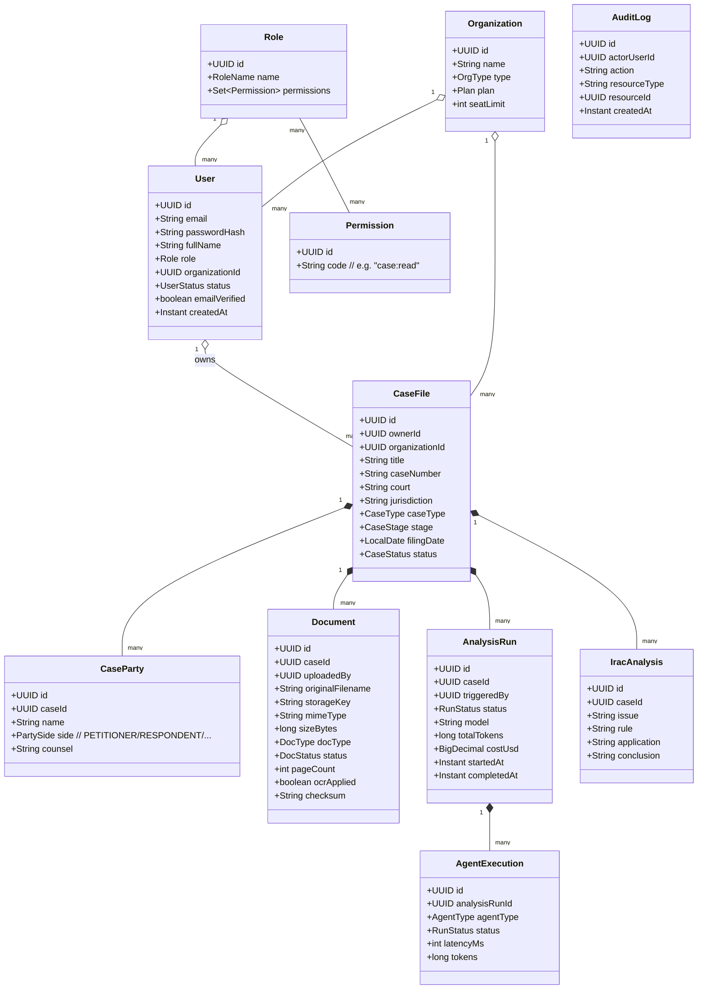
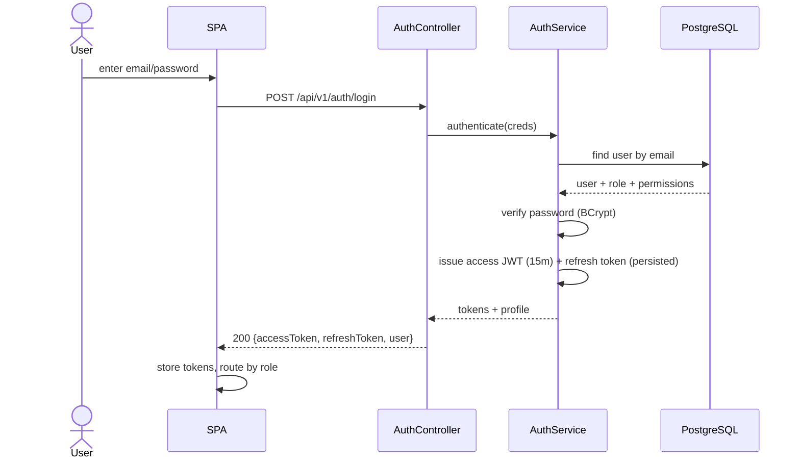
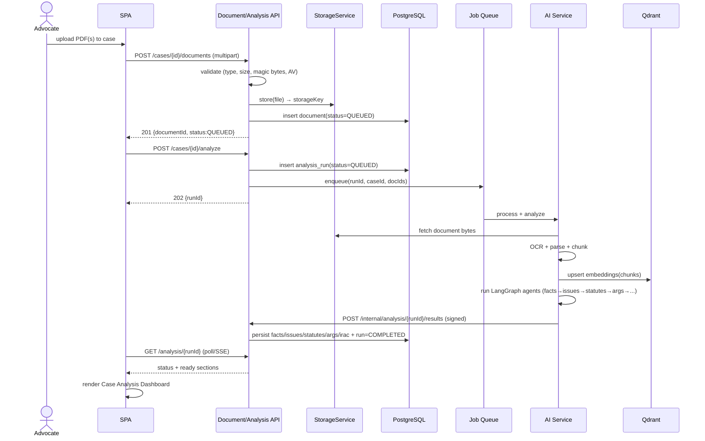
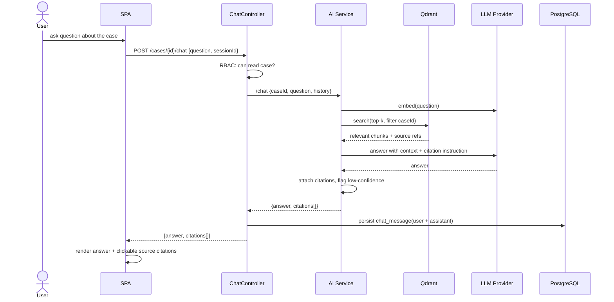

# LexMind AI — Low-Level Design (LLD)

**Document:** Phase 2 / 02
**Status:** Draft for review
**Owner:** Solution Architecture / Backend
**Last updated:** 2026-06-14

> Detailed design of the application tier: package structure, domain model classes, key
> service interfaces, and sequence diagrams for the critical flows. Implementation lands in
> Phase 4 (backend) and Phase 6 (AI).

---

## 1. Backend Package Structure (Spring Boot, Java 21)

Feature-oriented packaging (a package per bounded context), each with the standard layering.

```
com.lexmind
├── LexMindApplication.java
├── common/                     # cross-cutting
│   ├── config/                 # SecurityConfig, OpenApiConfig, AsyncConfig, CorsConfig
│   ├── security/               # JwtService, JwtAuthFilter, RbacEvaluator, UserPrincipal
│   ├── audit/                  # @Audited, AuditAspect, AuditService
│   ├── error/                  # ApiError, GlobalExceptionHandler, exceptions
│   ├── ratelimit/              # RateLimitFilter (bucket4j)
│   ├── dto/                    # PageResponse, ApiResponse envelope
│   └── util/                   # mappers, validators
├── auth/                       # register/login/refresh/reset
│   ├── api/  (AuthController, dto/)
│   ├── domain/ (User, Role, Permission, RefreshToken, PasswordResetToken)
│   ├── repo/   (UserRepository, RoleRepository, ...)
│   └── service/ (AuthService, TokenService, UserService)
├── organization/               # firm tenancy + seats
├── casefile/                   # cases (matters), parties, members
│   ├── api/ domain/ repo/ service/
├── document/                   # upload, storage, status, download
│   ├── api/ domain/ repo/ service/
│   └── storage/ (StorageService → LocalStorage | S3Storage)
├── analysis/                   # analysis runs + agent executions + result persistence
│   ├── api/ domain/ repo/ service/
│   └── client/ (AiServiceClient — WebClient)
├── intelligence/               # read-side: facts, timeline, issues, statutes, args,
│   │                           # evidence, witnesses, precedents, irac, brief
│   ├── api/ (DashboardController) domain/ repo/ service/
├── analytics/                  # strength, risk, readiness, trends
├── chat/                       # RAG chat sessions/messages
├── research/                   # citation, similar-case, notes
└── admin/                      # user mgmt, audit read, AI/doc monitoring
```

**Conventions**
- Controllers accept/return **DTOs** only; MapStruct (or manual mappers) convert ↔ entities.
- Services hold transactions (`@Transactional`) and business rules; repositories are thin.
- RBAC via `@PreAuthorize("hasAuthority('case:read')")` + a tenant/owner check in service.
- All mutating endpoints carry `@Audited`.

---

## 2. Domain Model — Class Diagram (core)



The full set of read-side intelligence entities (facts, timeline events, issues, statutes,
arguments, evidence, witnesses, precedents, briefs, analytics) is detailed in
[03-database-design.md](03-database-design.md).

---

## 3. Key Service Interfaces (contracts)

```java
public interface AnalysisService {
    /** Create a run, enqueue async processing, return run id immediately. */
    AnalysisRunDto startAnalysis(UUID caseId, AnalysisOptions opts, UserPrincipal actor);

    AnalysisRunDto getRun(UUID runId, UserPrincipal actor);

    /** Called by the AI tier (internal, authenticated) to persist structured results. */
    void ingestResults(UUID runId, AgentResultsPayload payload);
}

public interface StorageService {
    StoredObject store(UUID caseId, MultipartFile file);   // LocalStorage | S3Storage
    Resource load(String storageKey);
    void delete(String storageKey);
}

public interface AiServiceClient {                          // WebClient → FastAPI
    Mono<ProcessAck> processDocument(ProcessDocRequest req);
    Mono<AgentResultsPayload> runAgents(RunAgentsRequest req);   // or async w/ callback
    Mono<ChatAnswer> chat(ChatRequest req);                 // RAG, case-scoped
}

public interface RbacEvaluator {
    boolean canAccessCase(UserPrincipal actor, UUID caseId, Action action);
}
```

---

## 4. Sequence Diagrams (critical flows)

### 4.1 Authentication (login + JWT)



### 4.2 Document upload → async analysis



### 4.3 RAG chat (grounded)



---

## 5. API Surface (v1 — preview; full OpenAPI in Phase 4)

| Method | Path | Auth | Permission |
|---|---|---|---|
| POST | `/api/v1/auth/register` | public | — |
| POST | `/api/v1/auth/login` | public | — |
| POST | `/api/v1/auth/refresh` | public(token) | — |
| POST | `/api/v1/auth/forgot-password` | public | — |
| POST | `/api/v1/auth/reset-password` | public(token) | — |
| GET | `/api/v1/cases` | JWT | `case:read` |
| POST | `/api/v1/cases` | JWT | `case:create` |
| GET | `/api/v1/cases/{id}` | JWT | `case:read` |
| POST | `/api/v1/cases/{id}/documents` | JWT | `document:upload` |
| GET | `/api/v1/documents/{id}/status` | JWT | `case:read` |
| POST | `/api/v1/cases/{id}/analyze` | JWT | `analysis:run` |
| GET | `/api/v1/analysis/{runId}` | JWT | `case:read` |
| GET | `/api/v1/cases/{id}/dashboard/overview` | JWT | `case:read` |
| GET | `/api/v1/cases/{id}/dashboard/{section}` | JWT | `case:read` |
| GET | `/api/v1/cases/{id}/irac` | JWT | `irac:view` |
| GET | `/api/v1/cases/{id}/brief` | JWT | `case:read` |
| POST | `/api/v1/cases/{id}/chat` | JWT | `case:read` |
| GET | `/api/v1/admin/users` | JWT | `user:manage` |
| GET | `/api/v1/admin/audit` | JWT | `audit:read` |
| POST | `/internal/analysis/{runId}/results` | service-token | internal |

Standard envelope:
```json
{ "data": { }, "error": null, "traceId": "..." }
```
Error:
```json
{ "data": null, "error": { "code": "CASE_NOT_FOUND", "message": "…", "details": [] }, "traceId": "…" }
```

---

## 6. Concurrency & Async Model

- API requests handled on Java 21 **virtual threads** (high I/O concurrency, simple code).
- Heavy work dispatched to a **job queue** (MVP: DB-backed jobs + Spring `@Async` executor;
  prod: Redis/RabbitMQ — see [ADR-0007](06-adrs.md)). Jobs are **idempotent** (keyed by
  `runId`) and retried with exponential backoff.
- AI tier runs CPU/IO-bound steps (OCR, embeddings) in worker processes; LLM calls are
  awaited with timeouts + circuit breaker.

---

## 7. Error & Resilience Strategy

| Failure | Behavior |
|---|---|
| AI tier down/timeout | Run marked `FAILED` with reason; dashboards already-computed remain viewable; user can retry. |
| OCR/parse failure on a doc | Document marked `FAILED`; surfaced in Document Monitoring; other docs proceed. |
| LLM rate limit | Backoff + retry; degrade to cheaper model if configured. |
| Partial agent failure | Persist successful agent outputs; mark failed agents; allow re-run of subset. |
| DB constraint violation | Mapped to `409`/`422` with clear `code`; never leak stack traces. |

---

_Previous: [← Architecture Overview](01-architecture-overview.md) · Next: [Database Design →](03-database-design.md)_
