# LexMind AI — Database Design

**Document:** Phase 2 / 03
**Status:** Draft for review
**Owner:** Database Architecture
**Last updated:** 2026-06-14

> Conceptual + logical data model for PostgreSQL (the system of record). The runnable DDL is
> [04-schema.sql](04-schema.sql). Embeddings live in Qdrant (see
> [05-ai-architecture.md](05-ai-architecture.md)); PostgreSQL stores chunk text + the Qdrant
> point id so the two stay in sync.

---

## 1. Design Goals

- **Integrity:** foreign keys + constraints enforce legal-domain invariants.
- **Normalization to 3NF** for transactional/reference data; **JSONB** only for genuinely
  variable AI payloads and metadata (pragmatic hybrid).
- **Tenant isolation:** every tenant-scoped row carries `organization_id` (nullable for solo
  users); access enforced in the app + optional Postgres RLS later.
- **Auditability:** append-only `audit_logs`; analysis is versioned via `analysis_runs`.
- **Query performance:** deliberate indexes for the hot read paths (case lists, dashboard
  sections, audit search).
- **UUID primary keys** (`gen_random_uuid()` via `pgcrypto`) — safe to expose, merge-friendly.

---

## 2. Logical Schema — Subject Areas

1. **Identity & Access** — `organizations`, `users`, `roles`, `permissions`,
   `role_permissions`, `refresh_tokens`, `password_reset_tokens`.
2. **Case Workspace** — `cases`, `case_parties`, `case_members`.
3. **Documents** — `documents`, `document_chunks`.
4. **Analysis (runs)** — `analysis_runs`, `agent_executions`.
5. **Legal Intelligence (results)** — `case_facts`, `timeline_events`, `legal_issues`,
   `statutes` (KB), `case_statutes`, `arguments`, `evidence_items`, `witnesses`,
   `witness_statements`, `precedents`, `irac_analyses`, `case_briefs`.
6. **Analytics** — `case_strength`, `risk_assessments`, `readiness_scores`.
7. **Chat / Research** — `chat_sessions`, `chat_messages`, `research_notes`.
8. **Observability** — `audit_logs`, `ai_usage_logs`.
9. **Knowledge Base (precedent corpus)** — `kb_judgments`, `kb_judgment_chunks`.

---

## 3. ER Diagram (core)

```mermaid
erDiagram
    ORGANIZATIONS ||--o{ USERS : employs
    ORGANIZATIONS ||--o{ CASES : owns
    ROLES ||--o{ USERS : assigned
    ROLES ||--o{ ROLE_PERMISSIONS : has
    PERMISSIONS ||--o{ ROLE_PERMISSIONS : in
    USERS ||--o{ REFRESH_TOKENS : holds
    USERS ||--o{ CASES : owns
    USERS ||--o{ CASE_MEMBERS : participates

    CASES ||--o{ CASE_PARTIES : has
    CASES ||--o{ CASE_MEMBERS : shared_with
    CASES ||--o{ DOCUMENTS : contains
    CASES ||--o{ ANALYSIS_RUNS : analyzed_by
    CASES ||--o{ CASE_FACTS : has
    CASES ||--o{ TIMELINE_EVENTS : has
    CASES ||--o{ LEGAL_ISSUES : has
    CASES ||--o{ CASE_STATUTES : maps
    CASES ||--o{ ARGUMENTS : has
    CASES ||--o{ EVIDENCE_ITEMS : has
    CASES ||--o{ WITNESSES : has
    CASES ||--o{ PRECEDENTS : cites
    CASES ||--o{ IRAC_ANALYSES : has
    CASES ||--o{ CASE_BRIEFS : has
    CASES ||--o{ CASE_STRENGTH : scored
    CASES ||--o{ RISK_ASSESSMENTS : flagged
    CASES ||--o{ READINESS_SCORES : measured
    CASES ||--o{ CHAT_SESSIONS : discussed

    DOCUMENTS ||--o{ DOCUMENT_CHUNKS : split_into
    DOCUMENTS ||--o{ CASE_FACTS : sources
    DOCUMENTS ||--o{ EVIDENCE_ITEMS : sources

    ANALYSIS_RUNS ||--o{ AGENT_EXECUTIONS : runs
    ANALYSIS_RUNS ||--o{ CASE_FACTS : produced
    ANALYSIS_RUNS ||--o{ LEGAL_ISSUES : produced

    STATUTES ||--o{ CASE_STATUTES : referenced_by
    WITNESSES ||--o{ WITNESS_STATEMENTS : gives

    CHAT_SESSIONS ||--o{ CHAT_MESSAGES : contains
    USERS ||--o{ RESEARCH_NOTES : writes
    USERS ||--o{ AUDIT_LOGS : acts

    KB_JUDGMENTS ||--o{ KB_JUDGMENT_CHUNKS : split_into
    KB_JUDGMENTS ||--o{ PRECEDENTS : matched_as
```

> Entity attributes are fully specified in the DDL ([04-schema.sql](04-schema.sql)). The
> diagram above focuses on relationships and cardinality.

---

## 4. Key Entities & Rationale

| Table | Purpose | Notable columns / notes |
|---|---|---|
| `organizations` | Firm tenant | `type` (SOLO/FIRM/INSTITUTION), `plan`, `seat_limit` |
| `users` | All accounts | `role_id`, `organization_id` (nullable), `status`, `email_verified`, unique `email` |
| `roles` / `permissions` / `role_permissions` | RBAC | seeded with 5 roles + permission codes from PRD matrix |
| `cases` | A matter | `case_number`, `court`, `jurisdiction`, `case_type`, `stage`, `status`, owner+org |
| `case_parties` | Parties | `side` enum (PETITIONER/RESPONDENT/PLAINTIFF/DEFENDANT/OTHER) |
| `case_members` | Firm sharing | `(case_id,user_id)` unique, `access_level` |
| `documents` | Uploaded files | `doc_type`, `status`, `storage_key`, `checksum`, `ocr_applied` |
| `document_chunks` | RAG chunks | `chunk_index`, `content`, `token_count`, `page_no`, `qdrant_point_id` |
| `analysis_runs` | Versioned analysis | `status`, `model`, `total_tokens`, `cost_usd`, timings |
| `agent_executions` | Per-agent telemetry | `agent_type`, `status`, `latency_ms`, `tokens` |
| `case_facts` | Fact matrix | `fact_status` (ESTABLISHED/DISPUTED/MISSING), `source_document_id`, `source_excerpt`, `confidence` |
| `timeline_events` | Chronology | `event_date`, `event_type`, `sort_order`, source ref |
| `legal_issues` | Issues | `issue_type` (PRIMARY/SECONDARY), `rank`, `importance_score` |
| `statutes` | KB of laws | `act_name`, `section`, `category` (Constitution/Criminal/Civil/...) |
| `case_statutes` | Mapping | `applicability_note`, `confidence`, FK→`statutes` + `cases` |
| `arguments` | Argument map | `party_side`, `strength`, `argument_text`, source |
| `evidence_items` | Evidence | `evidence_type` (DOCUMENTARY/ORAL/ELECTRONIC/EXPERT), `strength`, `relevance`, `weakness_note` |
| `witnesses` / `witness_statements` | Witness analysis | contradictions, corroborations, reliability notes |
| `precedents` | Similar cases | `cited_case_name`, `citation`, `relevance_score`, `relationship_type`, optional FK→`kb_judgments` |
| `irac_analyses` | IRAC | `issue`,`rule`,`application`,`conclusion`, optional `legal_issue_id` |
| `case_briefs` | Brief | `content_json` (structured), `generated_at` |
| `case_strength` / `risk_assessments` / `readiness_scores` | Analytics | scores + structured findings |
| `chat_sessions` / `chat_messages` | RAG chat | `citations_json`, `role`, `tokens` |
| `research_notes` | Notes | user-scoped, optional case link |
| `audit_logs` | Audit | append-only; `action`, `resource_type`, `resource_id`, `metadata_json`, ip/ua |
| `ai_usage_logs` | Cost/observability | per-call tokens, cost, model, latency |
| `kb_judgments` / `kb_judgment_chunks` | Precedent corpus | seed public judgments for similarity search |

---

## 5. Normalization Notes

- **1NF/2NF/3NF:** reference data (roles, permissions, statutes) is fully normalized;
  mapping tables (`role_permissions`, `case_statutes`) remove M:N redundancy.
- **Controlled denormalization:** `readiness_scores` stores the four sub-scores + an overall
  for fast dashboard reads (cheap to recompute, frequently read).
- **JSONB usage (deliberate, bounded):** `case_briefs.content_json`,
  `chat_messages.citations_json`, `agent_executions.output_json`,
  `audit_logs.metadata_json`, `*.findings_json`. Used where the shape is variable or where
  the payload is read as a whole, never where we need to query/join on inner fields.
- **Enums:** modeled as `VARCHAR + CHECK` (portable, migration-friendly) rather than native
  PG enums, so values can evolve without `ALTER TYPE` friction.

---

## 6. Index Strategy

| Index | Table(s) | Type | Rationale |
|---|---|---|---|
| `users(email)` | users | UNIQUE | login lookup |
| `users(organization_id)` | users | btree | firm member listing |
| `cases(owner_id, status)` | cases | btree composite | "my cases" filtered list |
| `cases(organization_id, status)` | cases | btree composite | firm case repository |
| `cases(case_number)` | cases | btree | search by number |
| `documents(case_id, status)` | documents | btree composite | doc list + pipeline status |
| `document_chunks(document_id, chunk_index)` | document_chunks | btree composite | ordered retrieval |
| `document_chunks(qdrant_point_id)` | document_chunks | UNIQUE | sync with vector store |
| `analysis_runs(case_id, status)` | analysis_runs | btree | latest run per case |
| `case_facts(case_id, fact_status)` | case_facts | btree | fact-matrix tabs |
| `timeline_events(case_id, sort_order)` | timeline_events | btree | ordered timeline |
| `legal_issues(case_id, rank)` | legal_issues | btree | ranked issues |
| `case_statutes(case_id)` / `(statute_id)` | case_statutes | btree | both directions |
| `arguments(case_id, party_side)` | arguments | btree | side-by-side panels |
| `chat_messages(session_id, created_at)` | chat_messages | btree | message history |
| `audit_logs(actor_user_id, created_at)` | audit_logs | btree | audit search |
| `audit_logs(resource_type, resource_id)` | audit_logs | btree | per-resource trail |
| `cases(title) gin_trgm` | cases | GIN (pg_trgm) | fuzzy global search (v1) |

**Partitioning (future):** `audit_logs` and `ai_usage_logs` are append-heavy and time-series
in nature → candidates for monthly range partitioning at scale (noted, not in MVP DDL).

---

## 7. Data Lifecycle & Integrity

- **Cascade deletes:** deleting a `case` cascades to its documents, chunks, analysis runs,
  and all intelligence/analytics children (`ON DELETE CASCADE`). Deleting a `user` is
  restricted if they own cases (soft-delete/transfer instead).
- **Soft delete:** `cases.status = ARCHIVED` and `users.status = SUSPENDED/DELETED` rather
  than hard delete, preserving audit/billing history.
- **Timestamps:** every table has `created_at`; mutable tables have `updated_at` maintained
  by a trigger.
- **Referential actions** chosen per relationship (cascade for owned children, restrict for
  shared references like `statutes`).
- **Vector consistency:** on document delete, the app removes the matching Qdrant points by
  `qdrant_point_id`; a reconciliation job catches orphans.

---

## 8. Capacity & Performance Notes

- Hot reads (case list, dashboard sections) are single-case, index-covered → fast.
- Heavy writes happen in **batches** at the end of an analysis run (one transaction per
  result type) to minimize lock time.
- Connection pooling via HikariCP (backend) sized to DB limits.
- `EXPLAIN ANALYZE` review of dashboard queries is part of Phase 8 (testing/perf).

---

_Previous: [← Low-Level Design](02-low-level-design.md) · Next: [PostgreSQL Schema (DDL) →](04-schema.sql)_
