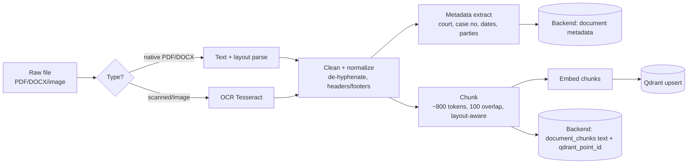
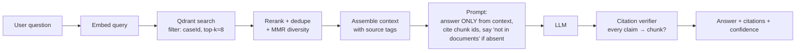
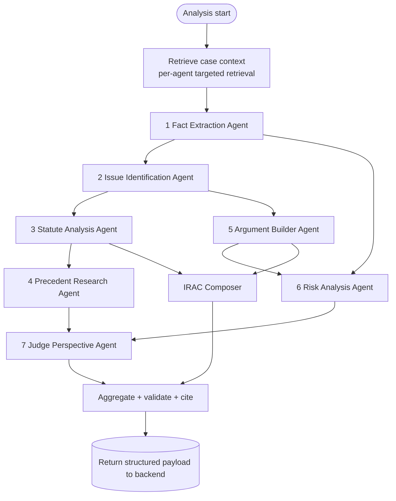

# LexMind AI — AI Architecture

**Document:** Phase 2 / 05
**Status:** Draft for review
**Owner:** AI/ML Engineering
**Last updated:** 2026-06-14

> How the AI tier turns documents into grounded, structured legal intelligence: the document
> pipeline, RAG, the LangGraph multi-agent graph, the vector store design, grounding/citation
> guarantees, and cost/latency controls. Implementation is Phase 6.

---

## 1. AI Tier Responsibilities

The FastAPI AI service owns four jobs:

1. **Ingestion pipeline** — OCR → parse → clean → chunk → embed → upsert to Qdrant.
2. **Multi-agent analysis** — the 7-agent LangGraph that emits structured results.
3. **RAG chat** — grounded Q&A over a case's documents.
4. **Similar-case discovery** — vector search over the precedent corpus.

It is **stateless per request** (no business data in memory); PostgreSQL (via the backend)
is the system of record, Qdrant is the retrieval index.

---

## 2. Document Ingestion Pipeline



**Chunking strategy:** semantic/structure-aware where possible (split on clauses, numbered
paragraphs, headings), target ~800 tokens with ~100 overlap so citations stay coherent.
Each chunk keeps `{documentId, caseId, page, charStart, charEnd}` so any retrieved chunk
maps back to a precise source location for citation.

**Document-type classification** (FIR / judgment / petition / …) uses a lightweight LLM
classification call on the first N tokens + filename heuristics; result stored on
`documents.doc_type`.

---

## 3. RAG Architecture



**Grounding guarantees (NFR-6):**
- The system prompt forbids using outside knowledge for case facts; the model must answer
  *only* from retrieved context and **explicitly say when the answer is not in the
  documents**.
- Every assertion must carry a citation to a `chunkId`; a post-step **verifier** checks that
  cited chunks exist and that unsupported sentences are flagged as low-confidence.
- Retrieval is **case-scoped** by a Qdrant payload filter (`caseId`) so one case can never
  leak another's content (also a security boundary).

---

## 4. Multi-Agent Analysis (LangGraph)

The 7 agents from the PRD run as a **stateful graph**. Shared state accumulates structured
outputs; later agents read earlier outputs.



### Shared graph state (conceptual)

```python
class CaseAnalysisState(TypedDict):
    case_id: str
    retrieved: dict[str, list[Chunk]]   # per-agent retrieved context
    facts: list[Fact]                   # established/disputed/missing
    timeline: list[TimelineEvent]
    issues: list[Issue]                 # ranked
    statutes: list[StatuteMatch]
    arguments: dict[str, list[Argument]] # petitioner / respondent
    precedents: list[Precedent]
    risks: list[Risk]
    judge_view: list[JudgeQuestion]
    irac: list[Irac]
    usage: UsageMeter                   # tokens, cost
    errors: list[AgentError]
```

### Agent responsibilities & I/O

| # | Agent | Reads | Produces | Maps to tables |
|---|---|---|---|---|
| 1 | **Fact Extraction** | retrieved chunks | facts (status), dates, parties, events | `case_facts`, `timeline_events`, `case_parties` |
| 2 | **Issue Identification** | facts | ranked primary/secondary issues | `legal_issues` |
| 3 | **Statute Analysis** | issues, facts | applicable statutes + applicability | `case_statutes`, `statutes` |
| 4 | **Precedent Research** | issues, statutes | similar/landmark cases (vector search over corpus) | `precedents` |
| 5 | **Argument Builder** | facts, issues | petitioner vs respondent arguments | `arguments` |
| 6 | **Risk Analysis** | facts, arguments, evidence | weaknesses, contradictions, missing docs | `risk_assessments`, `case_strength` |
| 7 | **Judge Perspective** | issues, args, risks | key questions, concerns, critical issues | (`agent_executions.output_json`, surfaced in strategy) |
|  | **IRAC Composer** | issues, statutes, args | Issue/Rule/Application/Conclusion | `irac_analyses` |

**Orchestration features used:** conditional edges (skip precedent if no corpus match),
per-node retries with backoff, partial-failure tolerance (persist what succeeded, mark the
rest `FAILED`), and a usage meter that accumulates tokens/cost into `analysis_runs` +
`ai_usage_logs`.

**Model routing (cost control):** cheap/fast Claude for extraction/classification; the
strongest Claude (e.g. `claude-opus-4-8`) for reasoning-heavy agents (issues, arguments,
risk, judge perspective). Routing is config-driven behind the provider abstraction.

---

## 5. Vector Store (Qdrant) Design

Two collections:

| Collection | Holds | Payload (filterable) | Notes |
|---|---|---|---|
| `case_chunks` | per-user case document chunks | `caseId`, `documentId`, `docType`, `page`, `orgId` | strict `caseId` filter on every query (isolation) |
| `kb_judgments` | precedent corpus chunks | `judgmentId`, `court`, `category`, `date` | powers similar-case discovery |

- **Distance:** cosine. **Vector size:** matches embedding model (config).
- **Point id:** UUID mirrored into PostgreSQL (`document_chunks.qdrant_point_id`,
  `kb_judgment_chunks.qdrant_point_id`) for two-way sync + orphan reconciliation.
- **Multitenancy:** payload filter (`orgId`/`caseId`) is mandatory; Qdrant payload index on
  `caseId` for fast filtered search.
- **Why Qdrant** (vs Chroma): production ANN performance, first-class payload filtering,
  Docker/managed options, horizontal scaling — see [ADR-0001](06-adrs.md).

---

## 6. AI Service API (internal contract — preview)

| Method | Path | Purpose |
|---|---|---|
| POST | `/process` | OCR/parse/chunk/embed one document; returns chunks + metadata |
| POST | `/analyze` | run the agent graph for a case; returns structured payload (or async + callback) |
| POST | `/chat` | RAG answer for a case-scoped question + citations |
| POST | `/similar` | similar-case discovery over corpus |
| GET | `/health` / `/ready` | liveness/readiness |

Auth between backend↔AI is a **service token** (not user JWT); requests carry a correlation
id for tracing.

---

## 7. Prompt & Output Discipline

- **Structured outputs:** agents return **validated JSON** (Pydantic schema per agent); a
  repair step re-asks on schema violation. No free-form prose where structure is expected.
- **Source-tagged context:** every chunk in a prompt is wrapped with its `chunkId` so the
  model can cite precisely.
- **Refusal/uncertainty:** agents must emit `confidence` and may return `MISSING` facts /
  "insufficient information" instead of inventing content.
- **No legal advice:** outputs are analytical; the composer appends the standard disclaimer
  and never phrases conclusions as advice or guarantees.
- **Prompt versioning:** prompts are versioned assets (in-repo) so analyses are reproducible
  and A/B-testable.

---

## 8. Cost, Latency & Reliability

| Lever | Mechanism |
|---|---|
| **Cost** | model routing (cheap vs strong), context trimming via reranking, caching of embeddings + classification, tiered per-plan limits |
| **Latency** | async analysis with streaming/section-wise persistence; parallel independent agents; top-k tuned |
| **Reliability** | per-node retries, circuit breaker on provider, partial-result persistence, idempotent runs keyed by `runId` |
| **Observability** | `ai_usage_logs` per call (tokens/cost/latency/model); agent-level telemetry in `agent_executions`; surfaced in Admin AI Monitoring |
| **Quality** | citation verifier, schema validation, eval harness (golden cases) in Phase 8 |

---

## 9. Data Privacy in the AI Tier

- Case content is sent to the LLM provider only as needed; provider abstraction allows a
  **self-hosted model** for sensitive deployments (firm/enterprise).
- No cross-tenant retrieval (enforced payload filters).
- Prompt/response logging stores **metadata + token counts by default**, with raw content
  logging gated behind an explicit, audited debug flag.
- Aligns with PRD NFR-4/5 and [ADR-0008](06-adrs.md).

---

_Previous: [← Database Design](03-database-design.md) · Next: [ADRs →](06-adrs.md)_
