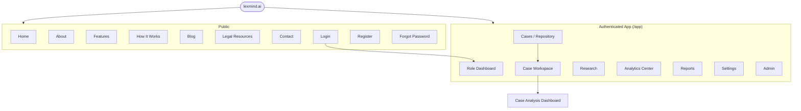
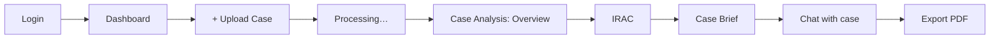
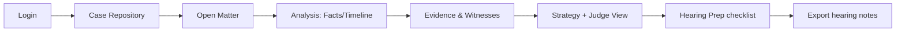
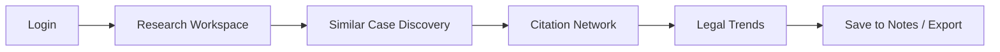

# LexMind AI — Information Architecture & Navigation

**Document:** Phase 3 / 02
**Status:** Draft for review
**Owner:** UI/UX Design
**Last updated:** 2026-06-14

> The sitemap, URL/route structure, and role-aware navigation. Routes here become the React
> Router tree in [04-component-hierarchy.md](04-component-hierarchy.md); visibility follows the
> [PRD RBAC matrix](../phase-01-product/05-prd.md).

---

## 1. Top-Level Sitemap



---

## 2. URL / Route Map

### 2.1 Public (no auth)
```
/                     Home / landing
/about                About
/features             Features
/how-it-works         How It Works
/blog        /blog/:slug
/resources            Legal Resources
/contact              Contact
/login                Login
/register             Register
/forgot-password      Forgot password
/reset-password       Reset (token)
/legal/terms  /legal/privacy   ToS / Privacy (+ "no legal advice" notice)
```

### 2.2 Authenticated app (`/app`, JWT required)
```
/app                                  → redirects to role dashboard
/app/dashboard                        Role-specific dashboard (student/advocate/researcher/firm)

/app/cases                            Case repository (list/filter/search)
/app/cases/new                        Create case
/app/cases/:caseId                    Case workspace (overview shell)
/app/cases/:caseId/analysis           Case Analysis Dashboard (tabbed):
        ?tab=overview|timeline|facts|issues|statutes|arguments|evidence|witnesses|precedents
/app/cases/:caseId/irac               IRAC Dashboard
/app/cases/:caseId/brief              Case Brief
/app/cases/:caseId/chat               Legal Research Assistant (RAG chat)
/app/cases/:caseId/documents          Documents + viewer
/app/cases/:caseId/strategy           Strategy Dashboard            (advocate+)
/app/cases/:caseId/hearing            Hearing Preparation Center    (advocate+)
/app/cases/:caseId/analytics          Per-case strength/risk/readiness

/app/research                         Research workspace            (researcher/student)
/app/research/citations               Citation analysis
/app/research/similar                 Similar-case discovery
/app/research/trends                  Legal trend analysis
/app/research/notes                   Research notes

/app/analytics                        Analytics Center (portfolio)  (advocate/firm)

/app/reports                          Reports Center / exports
/app/settings                         Profile, security, theme, preferences
/app/settings/team                    Team & seats                  (firm admin)

/app/admin                            Admin home                    (super admin / firm admin)
/app/admin/users                      User management
/app/admin/ai-monitoring              AI monitoring                 (super admin)
/app/admin/documents                  Document monitoring           (super admin)
/app/admin/analytics                  Platform analytics            (super admin)
/app/admin/audit                      Audit logs
```

**Route guards:** `<ProtectedRoute requiredPermission="...">` checks the JWT's role/
permissions; unauthorized → 403 screen; unauthenticated → `/login?next=`.

---

## 3. Role-Based Primary Navigation

The left sidebar renders only items the role's permissions allow.

### 3.1 Law Student
```
◧ Dashboard
▤ My Cases
   └ + Upload Case
◎ IRAC
✎ Case Briefs
⌕ Research          (citations, similar cases, notes)
≣ Learning Dashboard
⚙ Settings
```

### 3.2 Advocate
```
◧ Dashboard
▤ Case Repository
   └ + New Matter
◫ Matter Workspace  (overview · documents · analysis · chat)
🛡 Evidence & Witnesses
♜ Strategy
⚖ Hearing Prep
▦ Analytics Center
⌕ Research
⤓ Reports
⚙ Settings
```

### 3.3 Researcher
```
◧ Dashboard
▤ My Cases
⌕ Research Workspace
   ├ Citation Analysis
   ├ Similar Case Discovery
   └ Legal Trends
✎ Notes
⤓ Reports
⚙ Settings
```

### 3.4 Law Firm Admin
```
◧ Firm Dashboard
▤ All Matters        (firm-scoped)
▦ Analytics Center   (portfolio readiness/risk)
👥 Team & Seats
🗎 Audit (firm)
⚙ Settings
```
*(Firm admins also have the Advocate feature set for matters they work on.)*

### 3.5 Super Admin
```
◧ Admin Dashboard
👥 User Management
🤖 AI Monitoring
🗀 Document Monitoring
▦ Platform Analytics
🗎 Audit Logs
⚙ System Settings
```

---

## 4. Global Navigation Patterns

| Pattern | Behavior |
|---|---|
| **App bar** | breadcrumbs (left) · global ⌘K search (center) · theme toggle, notifications, profile menu (right) |
| **⌘K Command palette** | jump to any case, screen, or action; search across cases/documents |
| **Breadcrumbs** | `Cases / {Case Title} / Analysis / Evidence` — every nested route |
| **Case sub-nav** | within a case, a secondary tab bar: Overview · Documents · Analysis · IRAC · Brief · Chat · Strategy · Hearing · Analytics (role-filtered) |
| **Quick actions** | persistent "+ Upload / + New Case" FAB-style button |
| **Notifications** | analysis-complete, processing-failed, hearing reminders |

---

## 5. Primary User Journeys (navigation flows)

### 5.1 Student — understand a judgment


### 5.2 Advocate — prepare for a hearing


### 5.3 Researcher — find precedents


---

## 6. Empty / First-Run IA

A brand-new user lands on a **role-tailored empty dashboard** with a single primary CTA
("Upload your first case") + 2–3 sample/demo cases they can open read-only to see the product
populated before uploading their own. This de-risks the cold start identified in Phase 1.

---

## 7. Responsive Navigation Behavior

| Width | Sidebar | App bar |
|---|---|---|
| ≥ lg (1024) | full labeled sidebar | full |
| md–lg | icon rail (hover/expand) | full |
| < md | hidden → hamburger opens Sheet drawer | search collapses to icon |

Case sub-tabs become a horizontally scrollable tab strip on mobile; multi-column dashboards
stack to single column.

---

_Previous: [← Design System](01-design-system.md) · Next: [Wireframes →](03-wireframes.md)_
