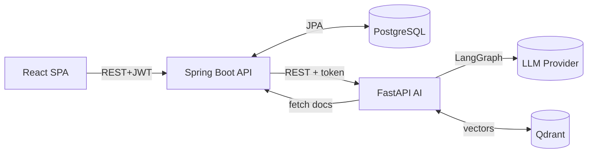
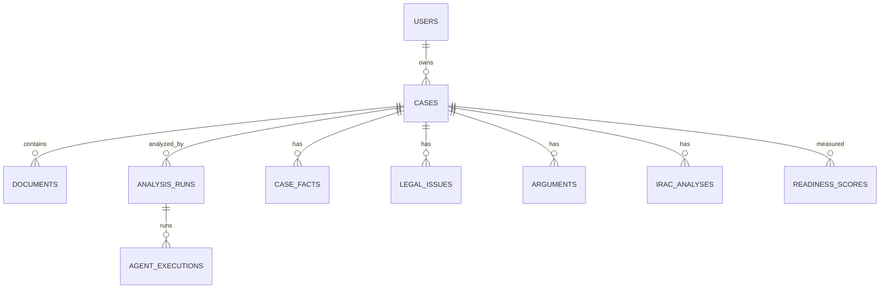

# Software Design Document (SDD)

## LexMind AI

**Version:** 1.0 · **Date:** 2026-06-14

> Consolidates the design produced in Phase 2 (architecture, database, AI) and Phase 3 (UI/UX)
> into a single design reference. Detailed diagrams live in
> [`docs/phase-02-architecture`](../phase-02-architecture/) and
> [`docs/phase-03-uiux`](../phase-03-uiux/).

---

## 1. Introduction
This document describes the architecture and detailed design of LexMind AI: components, data
model, interfaces, and key flows. It complements the [SRS](02-srs.md).

## 2. Design Goals & Principles
Separation of concerns by runtime; stateless application tier; async for slow work; grounded AI;
PostgreSQL as system of record; secure & auditable by default; provider-abstracted AI.
(See [Architecture Overview](../phase-02-architecture/01-architecture-overview.md).)

## 3. System Architecture (High-Level)
Three independently deployable tiers:
- **Frontend SPA** (React/TS) — UI, role-aware routing, dashboards, charts.
- **Application API** (Spring Boot) — AuthN/Z, RBAC, persistence, AI orchestration, audit.
- **AI service** (FastAPI) — document pipeline, 7-agent LangGraph, RAG.
Backing services: **PostgreSQL** (SoR), **Qdrant** (vectors), object storage, LLM provider.

## 4. Detailed Design (Low-Level)
Application tier uses **Controller → Service → Repository** layering, DTOs at the boundary, and
cross-cutting filters/aspects (security, audit, error handling). Bounded contexts: `auth`,
`organization`, `casefile`, `document`, `analysis`, `intelligence`, `analytics`, `common`.
Full class and sequence diagrams: [Low-Level Design](../phase-02-architecture/02-low-level-design.md).

### 4.1 Key Sequence — Upload → Async Analysis
1. SPA uploads documents → API validates + stores (QUEUED).
2. SPA triggers analyze → API creates `analysis_run` (202) → async orchestrator.
3. Orchestrator calls AI `/analyze`; AI fetches doc text, runs 7 agents, returns payload.
4. Ingest service persists facts/timeline/issues/arguments/IRAC + analytics; run COMPLETED.
5. SPA polls `/analysis/{runId}`; dashboard tabs fill progressively.

## 5. Data Design
Relational model in 3NF with JSONB for variable payloads; UUID keys; soft deletes; audit log.
Subject areas: identity & access, case workspace, documents, analysis runs, legal intelligence,
analytics, chat/research, observability, knowledge base. Embeddings live in Qdrant; PostgreSQL
stores chunk text + the Qdrant point id.
- **ER diagram & rationale:** [Database Design](../phase-02-architecture/03-database-design.md)
- **DDL:** [`04-schema.sql`](../phase-02-architecture/04-schema.sql) (also the Flyway `V1__init.sql`)

## 6. AI Subsystem Design
Pipeline: OCR/parse → clean → chunk (~800 tokens, 100 overlap) → embed → Qdrant. Analysis: a
**LangGraph StateGraph** of 7 agents (Fact → Issue → {Statute, Argument} → {Precedent, Risk} →
Judge → IRAC) with a deterministic analytics-synthesis step. RAG: case-scoped retrieval → grounded
answer with citations. Provider-abstracted LLM (mock | Claude). Details:
[AI Architecture](../phase-02-architecture/05-ai-architecture.md).

## 7. Interface Design (UI/UX)
Design system (tokens, dark/light, domain components), information architecture (sitemap, routes,
role-based navigation), wireframes (15 screens), and the React component hierarchy are specified
in [`docs/phase-03-uiux`](../phase-03-uiux/). The flagship screen is the tabbed Case Analysis
Dashboard; every AI surface shows citations, a confidence cue, and a "not legal advice" banner.

## 8. Security Design
Stateless JWT (access + rotating refresh); permissions embedded in the token; method-level RBAC
(`@PreAuthorize`) + a central per-case access guard; internal service-token for backend↔AI;
hashed refresh/reset tokens; standard error envelope (no stack traces); audit aspect; secure
file handling. OWASP Top-10 controls. (See [SRS NFR-3](02-srs.md) and
[ADR-0010](../phase-02-architecture/06-adrs.md).)

## 9. Deployment Design
Dockerized services orchestrated by Docker Compose (frontend nginx, backend, ai-service,
PostgreSQL, Qdrant). Cloud targets: Railway/Render/AWS. CI via GitHub Actions.
(See [Deployment Guide](../phase-09-deployment/deployment.md).)

## 10. Design Decisions (ADRs)
Twelve Architecture Decision Records capture the major choices (Qdrant, 3-tier split, Java/Spring,
FastAPI/LangGraph, PostgreSQL SoR, JWT, async pipeline, provider abstraction, multitenancy,
grounded AI, UUIDs/soft-delete, storage abstraction):
[ADRs](../phase-02-architecture/06-adrs.md).
